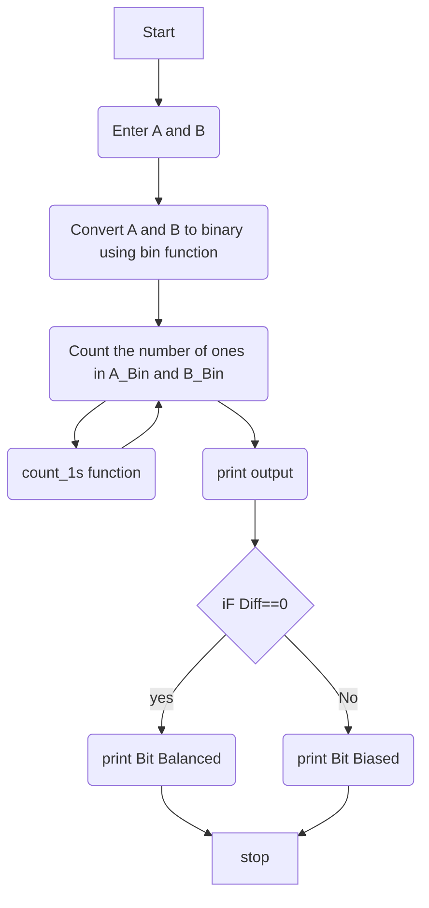
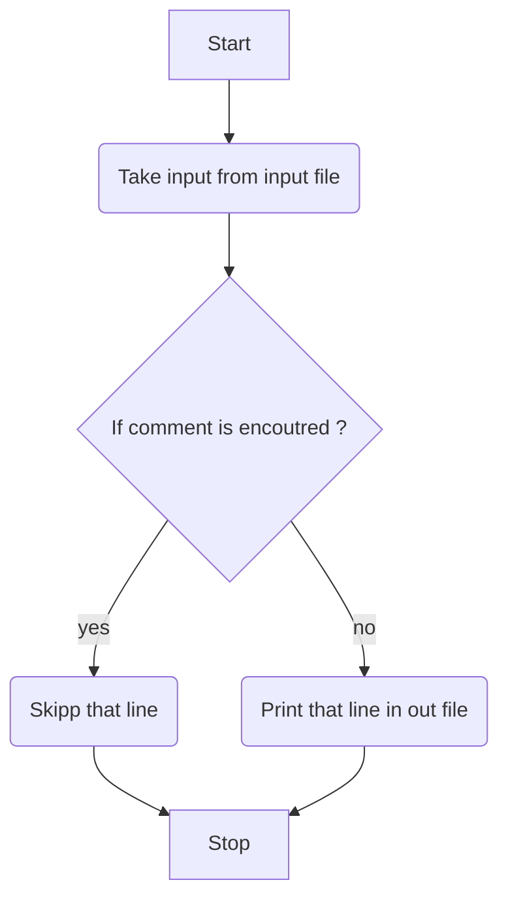

___

**Assignment** - 6

**Title:** Basic python programing and lex and yacc compiler design

**Course** : Telecommunication Network Laboratory 

**Course Code** : ELP 718

**Student:** Hrishikesh Saste  

**Entry No. :**  2020JTM2055

**Department:** Bharti School of Telecommunication Technology  and Management 

**Date:** 17/11/2020 

___


# Problem Statement 1

**A.**  **Given two non-zero numbers A and B, count the number of 1s in their binary representations. Output the following table:**

|                       | First Number A | Second Number B | Remark |
| --------------------- | -------------- | --------------- | ------ |
| Binary Representation |                |                 |        |

Explanation (two examples):

* Inputs are 8 and 4 
* Sample Output 1: **Bit Balanced! |8| - |4| = 1-1 = 0**
* Binary representation of 8 = 1000
* Binary representation of 4 = 0100
* Hence both contain equal number 1s, hence the output
* Inputs are 15 and 8 
* Sample Output 1: 
* **Bit Biased! |15| - |8| = 4 - 1 = 3**
* Binary representation of 15 = 1111 (FOUR 1s)
* Binary representation of  8 = 1000 (ONE 1)
* Hence both contain different number of 1s, hence the output 

## Assumptions 

* No assumption 

## Algorithm

* Two numbers are taken from keyboard 
* Converted from decimal to binary using inbuilt python function **bin()**
* Counted number of ones in each binary number using user defined function **count_1s**
* Ouput is printed on screen.
* If Diff==0, printed Bit Balanced 
* else printed Bit biased 

## Program Code 

```python
def count_1s(a,b):
    i=0
    count=0
    while(i<b):
        f=int(a[i])
        if f==1:
           count+=1
        i+=1
        return(count)
A=int(input('Enter the first number: '))
B=int(input('Enter the second number: '))
A_Bin=bin(A).replace("0b", "0")
B_Bin=bin(B).replace("0b", "0")
A1s=count_1s(A_Bin,len(A_Bin))
B1s=count_1s(B_Bin,len(B_Bin))
if (A1s>B1s):
    Diff=(A1s-B1s)
else:
    Diff=(B1s-A1s)
print('A \t B \t A Binary \t B binary \t Diffrence in number of ones ')
print('{0} \t {1} \t {2} \t     {3} \t         {4} '.format(A,B,A_Bin,B_Bin,Diff))
if(Diff==0):
    print('Bit Balanced ')
else:
    print('Bit Biased ')
```

## Program Flowchart 



## Screenshots 


## Difficulty Faced 

* Difficulty faced while executing code on ubuntu terminal


___

# Problem Statement 2

*  Lex and Yacc A 8085 assembler is designed in a way that it takes input assembly source code instructions in all capital letters and numbers in hexadecimal format suffixed by H.

* You will have to create a preprocessor for assembler that will translate any 8085 assembly code into full capital letters and all numerals into hexadecimal format suffixed by H.Use lex(flex) and Yacc(bison)• 
* Create a second file to store output assembly code.• Input is valid assembly source code with comments.• Comments are added after instructions starting with the ":" symbol.• Input source code is written both in lowercase letters as well as upper case letters.•
*  There are no comments and labels in the output assembly code.• Only a stream of instructions in upper case letters.• 
* Use command line arguments to supply input and output file names
*  **Input Format:****asm2allcap <input_file> <output_file>**
* Output Format:Store the converted data into an output file provided by the user through command line argument.If <output file> is not specified, the output should appear on **stdout**
* **Input file:** Input file contains 8085 assembly code with comments.If <input file> is not specified, the input should be taken from **stdin (eof is CTRL-D)**

## Assumptions 

* No assumptions 

## Algorithm 

* Input is taken from input file 
* if we find ; symbol then that line is skipped 
* Otherwise stored in the out file 
* Then lex file is executed by using following steps 
* * lex file.l
  * cc lex.yy.c 
  * ./a.out 


## Program Code 

```c
%{
#include <stdio.h>
#include <stdbool.h>
int comment_lines = 0;
bool in_comment = false;
%}

%%

";".* { ++comment_lines; }
[a-z] fprintf(yyout,yytext[0] - ('a' - 'A'));
.* { 
    if (in_comment) {
    ++comment_lines;
    } else {
    fprintf(yyout, yytext);  
    }
}

%%

int yywrap() {
    return 1;
}

int main(void) {
    printf("Enter input file: ");
    yyin = fopen("input.c", "r");

   
    yyout = fopen("out.c", "w");

    yylex();
    printf("Number of comments: %d\n", comment_lines);
}
```


## Program Flowchart



## Difficulty Faced 

* While understanding the lex analyzer working 


# References 

* https://docs.python.org/3/ 
* [**http://web.iitd.ac.in/~sumeet/flex__bison.pdf**](http://web.iitd.ac.in/~sumeet/flex__bison.pdf) 
* https://colab.research.google.com/drive/1TyK6OMWcdyfYGG9szNxCcNczmke4Ian_?usp=sharing